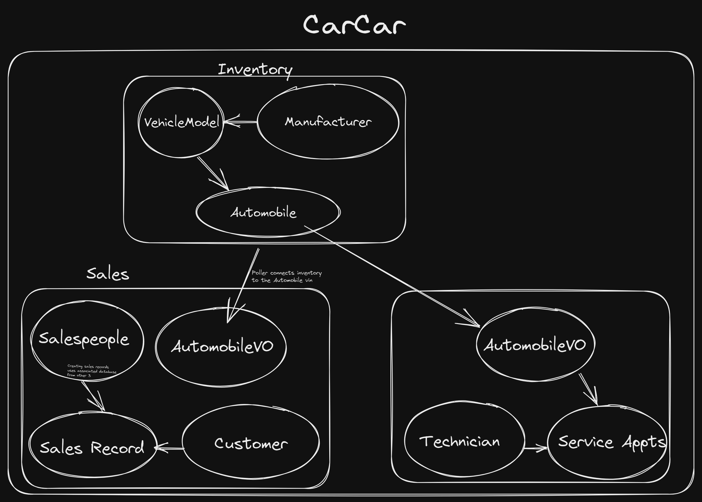
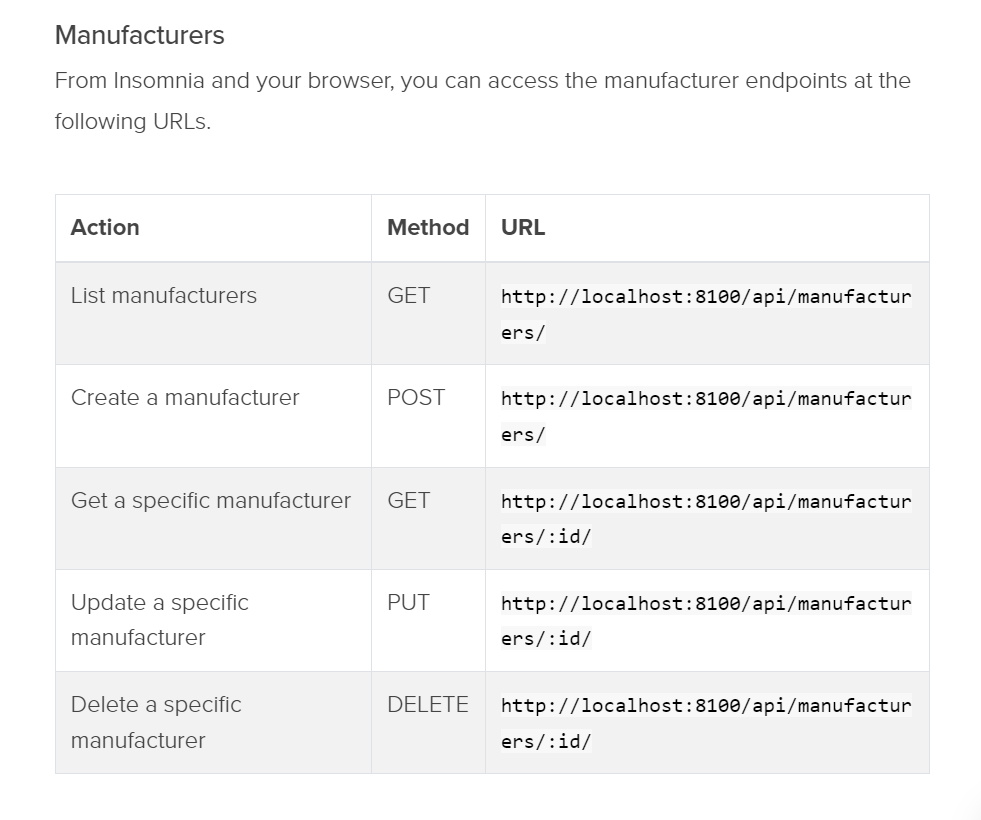
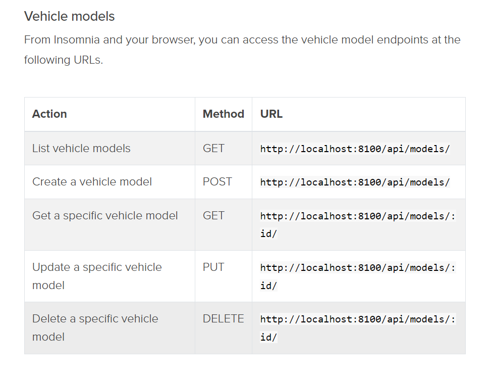
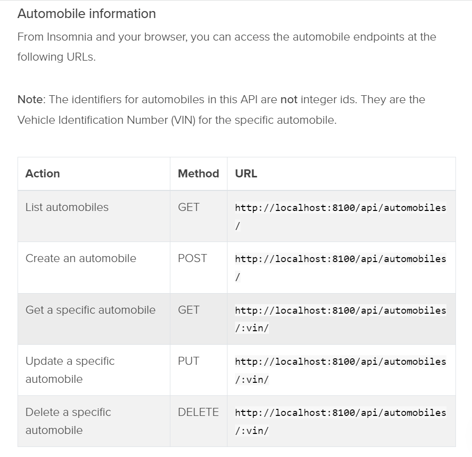

# CarCar
A web application that manages a Car companies salespeople, customers, automobile inventory, and the sales and services of relevant components.

Team:

- Ivan Tsang - Service
- James Lee - Sale

## How To Get Started:
**Ensure you have the neccessary programs; Docker, Git, Insomnia, Node.js**
1. Fork the projects repository [GitLab Repo](https://gitlab.com/sjp19-public-resources/sjp-2022-april/project-beta).
2. Clone onto your local environment in project directory.
```
git clone <<repository url here>>
```
3. Build up the project and run the containers with following commands:
```
docker volume create beta-data
docker-compose build
docker-compose up
```
After making sure all containers are good to go, visit [CarCar Webpage](http://localhost:3000/)
## Design

This project conists of 3 individual microservices that all communicate and interact with each other.
- Inventory
- Sales
- Services



## Accessing RESTful API Endpoints for Inventory
The backend is complete for this portion and we will be focusing on the front end creating the React components for associating API endpoints.

### Manufacture Endpoints

For POST requests, can post the following JSON formatted body into the Insomnia JSON window:
```
{
    "name": "Tesla"
}
```
For GET requests of the list of manufacturers or a specific manufacture id, the response will have the following structure:
```
{
  "manufacturers": [
    {
      "href": "/api/manufacturers/1/",
      "id": 1,
      "name": "Daimler-Chrysler"
    }
  ]
}
```
For GET requests of a specific manufacture, the response has following structure:
```
{
  "href": "/api/manufacturers/1/",
  "id": 1,
  "name": "Chrysler"
}
```

### Vehicle Model Endpoints

For POST requests, can post the following JSON formatted body into Insomnia JSON window:
```
{
  "name": "Sebring",
  "picture_url": "https://upload.wikimedia.org/wikipedia/commons/thumb/7/71/Chrysler_Sebring_front_20090302.jpg/320px-Chrysler_Sebring_front_20090302.jpg",
  "manufacturer_id": 1
}
```
For GET requests of entire list of vehicle models, response will have following structure:
```
{
  "models": [
    {
      "href": "/api/models/1/",
      "id": 1,
      "name": "Sebring",
      "picture_url": "https://upload.wikimedia.org/wikipedia/commons/thumb/7/71/Chrysler_Sebring_front_20090302.jpg/320px-Chrysler_Sebring_front_20090302.jpg",
      "manufacturer": {
        "href": "/api/manufacturers/1/",
        "id": 1,
        "name": "Daimler-Chrysler"
      }
    }
  ]
}
```
For GET requests of specific vehicle models, response will have following structure:
```
{
  "href": "/api/models/1/",
  "id": 1,
  "name": "Sebring",
  "picture_url": "https://upload.wikimedia.org/wikipedia/commons/thumb/7/71/Chrysler_Sebring_front_20090302.jpg/320px-Chrysler_Sebring_front_20090302.jpg",
  "manufacturer": {
    "href": "/api/manufacturers/1/",
    "id": 1,
    "name": "Daimler-Chrysler"
  }
}
```

### Automobile Endpoints

For POST requests, can post the following JSON formatted body into Insomnia JSON window:
```
{
  "color": "red",
  "year": 2012,
  "vin": "1C3CC5FB2AN120174",
  "model_id": 1
}
```
For GET requests of entire list of automobiles in inventory, response will have following structure:
```
{
  "autos": [
    {
      "href": "/api/automobiles/1C3CC5FB2AN120174/",
      "id": 1,
      "color": "yellow",
      "year": 2013,
      "vin": "1C3CC5FB2AN120174",
      "model": {
        "href": "/api/models/1/",
        "id": 1,
        "name": "Sebring",
        "picture_url": "https://upload.wikimedia.org/wikipedia/commons/thumb/7/71/Chrysler_Sebring_front_20090302.jpg/320px-Chrysler_Sebring_front_20090302.jpg",
        "manufacturer": {
          "href": "/api/manufacturers/1/",
          "id": 1,
          "name": "Daimler-Chrysler"
        }
      },
      "sold": false
    }
  ]
}
```
For GET requests of a specific automobile, response will have following structure:
```
{
  "href": "/api/automobiles/1C3CC5FB2AN120174/",
  "id": 1,
  "color": "yellow",
  "year": 2013,
  "vin": "1C3CC5FB2AN120174",
  "model": {
    "href": "/api/models/1/",
    "id": 1,
    "name": "Sebring",
    "picture_url": "https://upload.wikimedia.org/wikipedia/commons/thumb/7/71/Chrysler_Sebring_front_20090302.jpg/320px-Chrysler_Sebring_front_20090302.jpg",
    "manufacturer": {
      "href": "/api/manufacturers/1/",
      "id": 1,
      "name": "Daimler-Chrysler"
    }
  },
  "sold": false
}
```


## Service microservice

Explain your models and integration with the inventory
microservice, here.

## Sales microservice

Explain your models and integration with the inventory
microservice, here.
