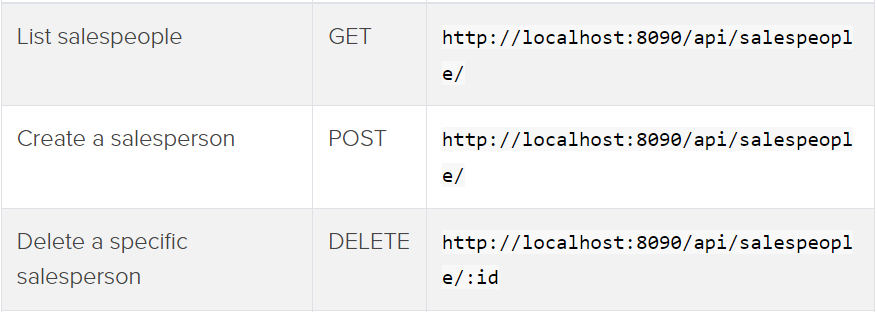
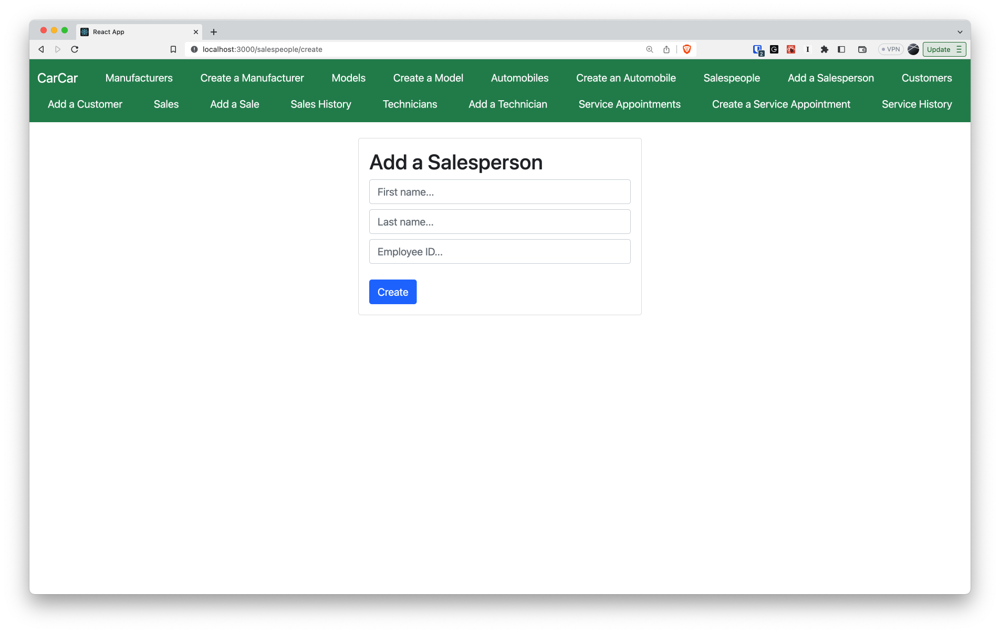
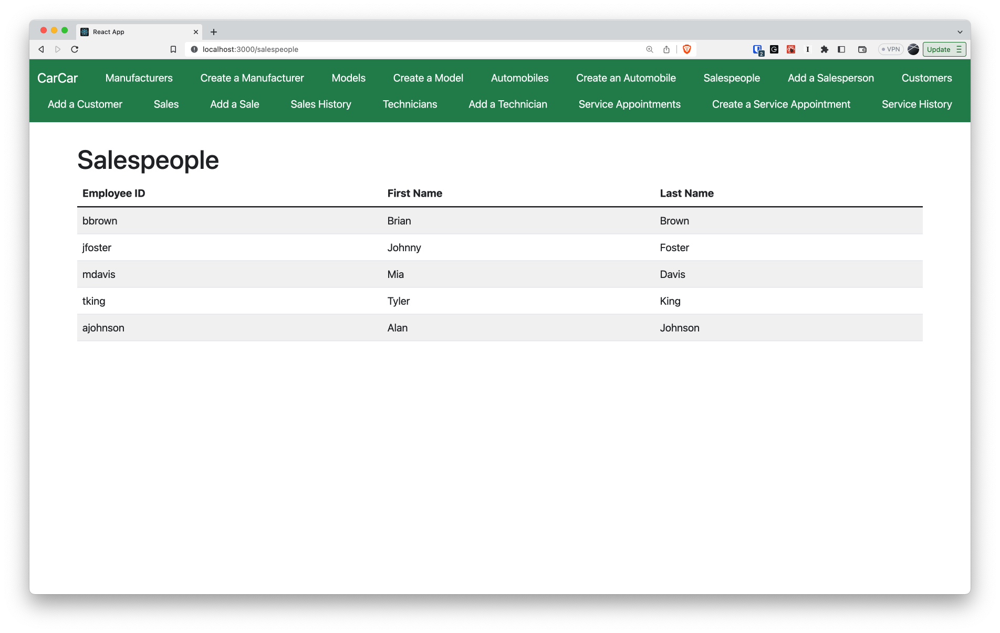
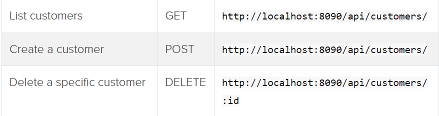
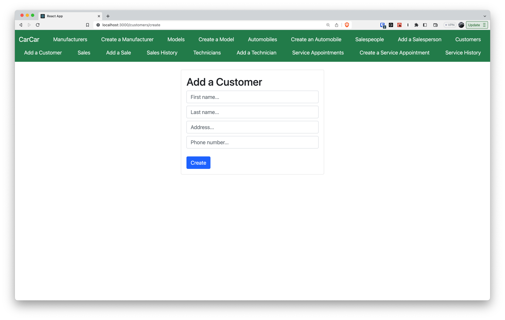
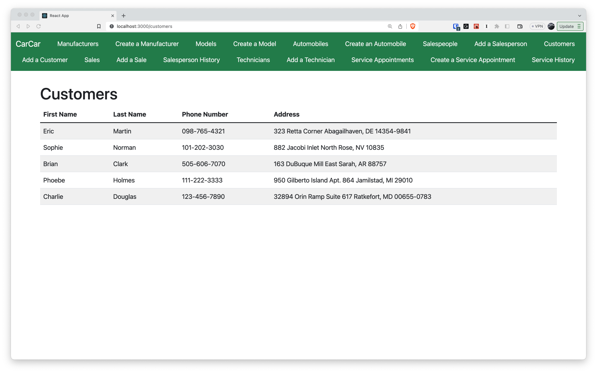
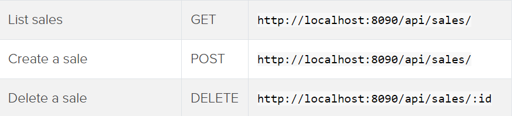
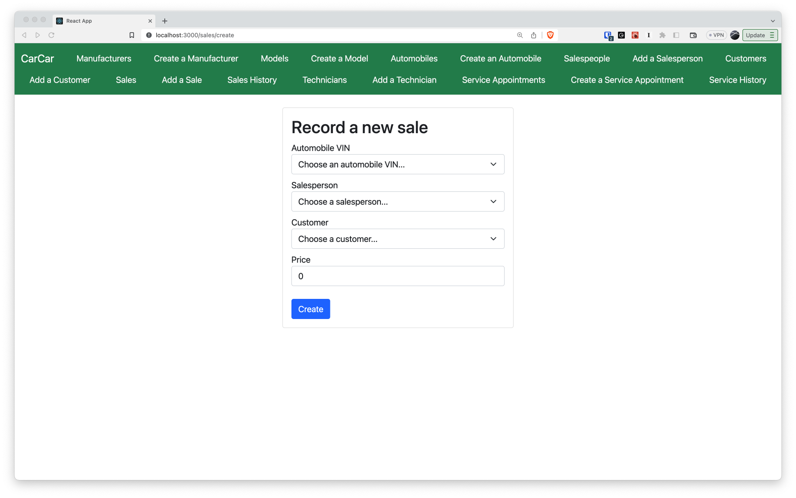
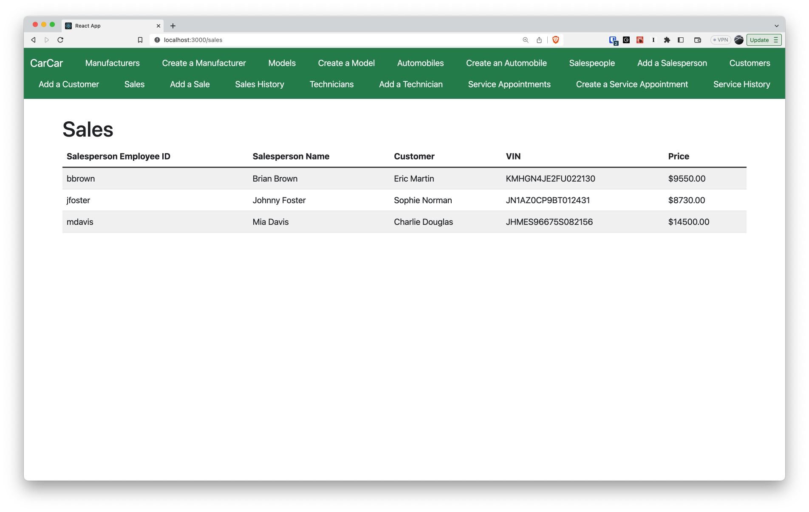
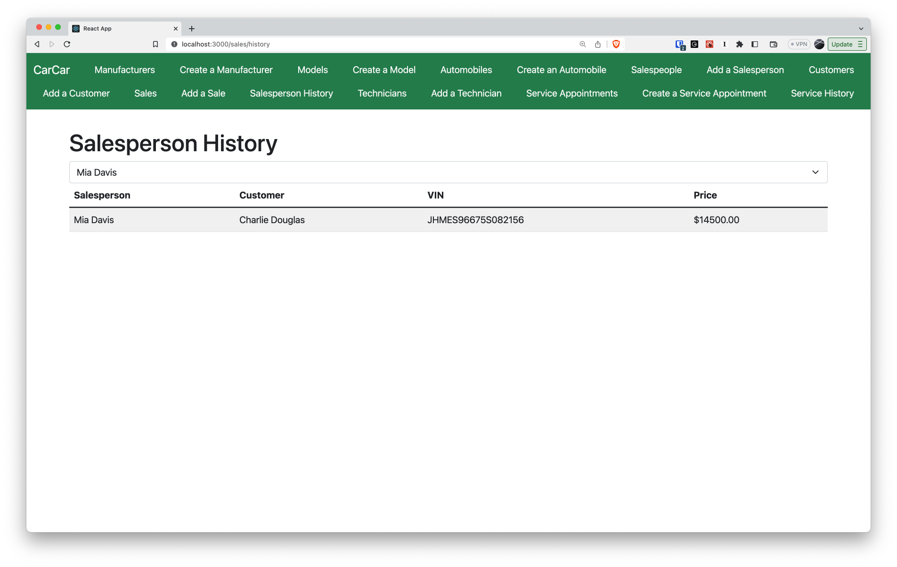

# CarCar
A web application that manages a Car companies salespeople, customers, automobile inventory, and the sales and services of relevant components.

Team:

- Ivan Tsang - Auto Service
- Person 2 - Which microservice?
- Ivan Tsang - Service
- James Lee - Sale

## How To Get Started:
**Ensure you have the neccessary programs; Docker, Git, Insomnia, Node.js**
1. Fork the projects repository [GitLab Repo](https://gitlab.com/sjp19-public-resources/sjp-2022-april/project-beta).
2. Clone onto your local environment in project directory.
```
git clone <<repository url here>>
```
3. Build up the project and run the containers with following commands:
```
docker volume create beta-data
docker-compose build
docker-compose up
```
After making sure all containers are good to go, visit [CarCar Webpage](http://localhost:3000/)
## Design

This project conists of 3 individual microservices that all communicate and interact with each other.
- Inventory
- Sales
- Services


## Accessing RESTful API Endpoints for Inventory
The backend is complete for this portion and we will be focusing on the front end creating the React components for associating API endpoints.

### Manufacture Endpoints

For POST requests, can post the following JSON formatted body into the Insomnia JSON window:
```
{
    "name": "Tesla"
}
```
For GET requests of the list of manufacturers or a specific manufacture id, the response will have the following structure:
```
{
  "manufacturers": [
    {
      "href": "/api/manufacturers/1/",
      "id": 1,
      "name": "Daimler-Chrysler"
    }
  ]
}
```
For GET requests of a specific manufacture, the response has following structure:
```
{
  "href": "/api/manufacturers/1/",
  "id": 1,
  "name": "Chrysler"
}
```

### Vehicle Model Endpoints

For POST requests, can post the following JSON formatted body into Insomnia JSON window:
```
{
  "name": "Sebring",
  "picture_url": "https://upload.wikimedia.org/wikipedia/commons/thumb/7/71/Chrysler_Sebring_front_20090302.jpg/320px-Chrysler_Sebring_front_20090302.jpg",
  "manufacturer_id": 1
}
```
For GET requests of entire list of vehicle models, response will have following structure:
```
{
  "models": [
    {
      "href": "/api/models/1/",
      "id": 1,
      "name": "Sebring",
      "picture_url": "https://upload.wikimedia.org/wikipedia/commons/thumb/7/71/Chrysler_Sebring_front_20090302.jpg/320px-Chrysler_Sebring_front_20090302.jpg",
      "manufacturer": {
        "href": "/api/manufacturers/1/",
        "id": 1,
        "name": "Daimler-Chrysler"
      }
    }
  ]
}
```
For GET requests of specific vehicle models, response will have following structure:
```
{
  "href": "/api/models/1/",
  "id": 1,
  "name": "Sebring",
  "picture_url": "https://upload.wikimedia.org/wikipedia/commons/thumb/7/71/Chrysler_Sebring_front_20090302.jpg/320px-Chrysler_Sebring_front_20090302.jpg",
  "manufacturer": {
    "href": "/api/manufacturers/1/",
    "id": 1,
    "name": "Daimler-Chrysler"
  }
}
```

### Automobile Endpoints

For POST requests, can post the following JSON formatted body into Insomnia JSON window:
```
{
  "color": "red",
  "year": 2012,
  "vin": "1C3CC5FB2AN120174",
  "model_id": 1
}
```
For GET requests of entire list of automobiles in inventory, response will have following structure:
```
{
  "autos": [
    {
      "href": "/api/automobiles/1C3CC5FB2AN120174/",
      "id": 1,
      "color": "yellow",
      "year": 2013,
      "vin": "1C3CC5FB2AN120174",
      "model": {
        "href": "/api/models/1/",
        "id": 1,
        "name": "Sebring",
        "picture_url": "https://upload.wikimedia.org/wikipedia/commons/thumb/7/71/Chrysler_Sebring_front_20090302.jpg/320px-Chrysler_Sebring_front_20090302.jpg",
        "manufacturer": {
          "href": "/api/manufacturers/1/",
          "id": 1,
          "name": "Daimler-Chrysler"
        }
      },
      "sold": false
    }
  ]
}
```
For GET requests of a specific automobile, response will have following structure:
```
{
  "href": "/api/automobiles/1C3CC5FB2AN120174/",
  "id": 1,
  "color": "yellow",
  "year": 2013,
  "vin": "1C3CC5FB2AN120174",
  "model": {
    "href": "/api/models/1/",
    "id": 1,
    "name": "Sebring",
    "picture_url": "https://upload.wikimedia.org/wikipedia/commons/thumb/7/71/Chrysler_Sebring_front_20090302.jpg/320px-Chrysler_Sebring_front_20090302.jpg",
    "manufacturer": {
      "href": "/api/manufacturers/1/",
      "id": 1,
      "name": "Daimler-Chrysler"
    }
  },
  "sold": false
}
```


## Service microservice

Introducing the service microservice!

###Service Appointments:

| Description                          | Method | URL                                                           |
| ------------------------------------ | ------ | ------------------------------------------------------------- |
| List service appointments            | GET    | http://localhost:8080/api/serviceappointment/                 |
| Create service appointment           | POST   | http://localhost:8080/api/serviceappointment/                 |
| Delete service appointment           | DELETE | http://localhost:8080/api/serviceappointment/<int:id>         |
| Set appointment status to 'canceled' | PUT    | http://localhost:8080/api/serviceappointment/<int:id>/cancel/ |
| Set appointment status to 'finished' | PUT    | http://localhost:8080/api/serviceappointment/<int:id>/finish/ |

##### Create Service Appointments:

This feature allows you to create a service appointment. The information will be returned in the following format:

```
{
  "vin": "WBS3R9C54GK708127",
  "customer": "Casper",
  "date_time": "2024-03-14T03:17",
  "reason": "Crank Hub",
  "technician": FooBar
}
```

##### List Service Appointment Detail:

This feature allows you to obtain a comprehensive list of all existing service appointments. The information will be presented in the following format:

```
{
	"appointments": [
		{
			"vin": "WBS3R9C54GK708127",
			"customer": "Casper",
			"date_time": "2023-06-08T19:22:00+00:00",
			"reason": "Crank Hub",
			"status": "finished",
			"vip": false,
			"canceled": false,
			"finished": false,
			"technician": {
				"first_name": "Daniel",
				"last_name": "Miller",
				"employee_id": "tech-22",
				"id": 21
			},
			"id": 2
		}
  ]
```

##### Delete an appointment:

To delete an appointment you'd have to use `Delete service appointment` - `http://localhost:8080/api/serviceappointment/<int:id>` URL at the top.

Example:

```
{
	"deleted": true
}
```

##### Updating the appointment status to "Canceled" or "Finished"

To update to either status you'd have to use `Set appointment status to 'canceled'` or `Set appointment status to 'finished'`

Example:

```
{
	"status": "finished"
}
```

OR

```
{
	"status": "canceled"
}
```

### Technicians

Introducing the technicians!

| Description                  | Method | URL                                       |
| ---------------------------- | ------ | ----------------------------------------- |
| List technicians             | GET    | http://localhost:8080/api/technicians/    |
| Create a technician          | POST   | http://localhost:8080/api/technicians/    |
| Delete a specific technician | DELETE | http://localhost:8080/api/technicians/:id |

##### Creating a technician:
To create a technician you'd need to use a `POST` request to `http://localhost:8080/api/technicians/` in the following format:
```
{
  "first_name": "Ivan",
  "last_name": "Casper",
  "employee_id": "tech-1",
}
```

##### Getting a list of technicians:
To get a list of technicians you'd need to use a `GET` request to `http://localhost:8080/api/technicians/` and it'll show in the following format:
```
{
	"technicians": [
    {
			"first_name": "Ivan",
			"last_name": "Casper",
			"employee_id": "tech-1",
			"id": 1
		}
	]
}
```

##### Deleting a technician:
To remove a technician you'd need to use a `DELETE` request to `http://localhost:8080/api/technicians/:id` and it'll show in the following format:
```
{
	"deleted": true
}
```

## Models:
The service model has 3 models:

##### Technician:
- first_name
- last_name
- employee_id

##### AutomobileVO:
- vin
- year
- color
- sold

##### Appointment:
- vin
- customer
- date_time
- reason
- status
- vip
- canceled
- finished
- technician

## Sales microservice

Sales microservice utilizes 4 models; Salesperson, Customer, Sale, and an AutomobileVO.
As shown in the diagram above, the Sale Model can be the Root Aggregate of this collage, due to it being dependent on the other 3 models to ensure a successsful sale.

It can even be seen in the endpoint of creating a sale record that the drop down for Automobile VIN (which comes from the poller of inventory), a salesperson from the list of salespeople, and the customer from a list of customers.

Because the status of an unsold automobile is `false` there is a dependence needed between the inventory poller, and the form for creating a sale to ensure automobiles with `"sold": true` is not shown in that populated list dropdown.

Poller then automatically updates the database of available automobiles, for which create sale record can utilize to ensure an already sold car, is not available to be sold again.

### Automobile Poller
First must complete the poller.py file to allow communication between the automobileVO model and the Sales model. Only update the code indicated by comments in `sales/poll/poller.py`. Do not alter code anywhere else. Poller should pass tests and should be executed from Docker Sales poller container using `python test_poller.py`.


### Salespeople RESTful API Endpoints
Must create the following RESTful APIs endpoints via backend view functions:


#### **Add a salesperson**
Must create a form that allows user to enter the first and last name, as well as an employee ID.
When form submitted, salesperson created in the applications database and rendered onto the salesperson list.
Then must create a link in the navbar in `Nav.js` to connect the element to the corresponding JS file.



#### **List all salespeople**
Must create a form that allows user to view the entire list of all registered salespeople in the database.



### Customer RESTful API Endpoints
Must create the following RESTful APIs endpoints via backend view functions:


#### **Add a customer**
Must create a form that allows user to enter the first and last name, address, and phone number.
When form submitted, customer is created in the applications database and rendered onto customers list.
Then must create a link in the navbar in `Nav.js` to connect the element to the corresponding JS file.



#### **List all customers**
Must create a form that allows user to view the entire list of all registered customers in the database.



### Sale RESTful API Endpoints
Must create the following RESTful APIs endpoints via backend view functions:


#### **Record a new sale**
Must create a form that allows user to select an available automobile using VIN as its identifying property from the inventory database utilizing poller refreshing the inventories database.
Then must select a salesperson and customer from database.
Then input the price for that automobile sale.



#### **List all sales**
Must create a form that allows user to view entire list of all completed sales in the database.



#### **Salesperson History**
You must show a list of sales by a specific salesperson. Done by creating a page with a dropdown populated with existing salespeople. When dropdown selection of salespeople changes, the list of sales changes to show all sales associated with the selected salesperson. List of sales contains salesperson, the customer, the automobile VIN, and the price of the sale.
Then must create a link in the navbar in `Nav.js` to connect the element to the corresponding JS file.




### Notes
- Each endpoint should return a `400` or `404` error if unsuccessful or attempting to access a model object that does not exist.
- **Your API should be able to pass the included tests.** Can find API tests within `sales/api/tests` folder.
Can run the API tests from Docker Sales API container using `python manage.py test.`
## Authors
- [@James Lee](https://gitlab.com/eeHyunwoo)
- [@Ivan Tsang](https://gitlab.com/ivntsng)
